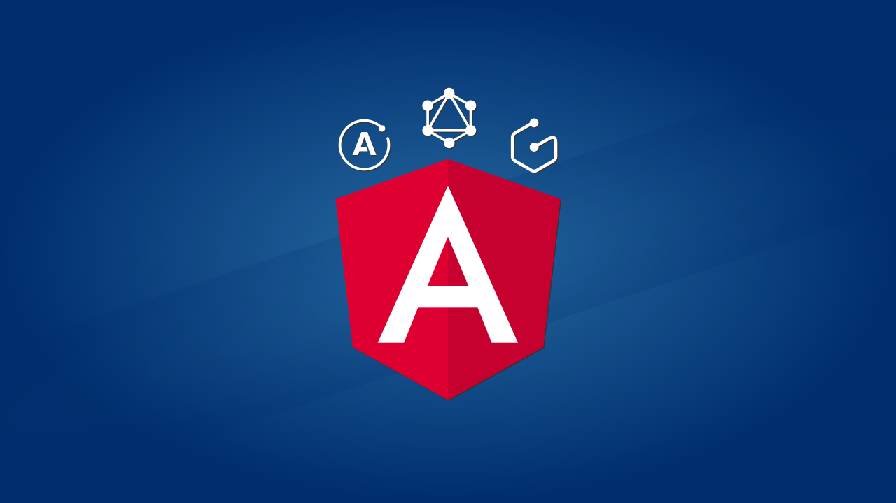

# Angular Graphcool Chat

Este é o repositório do projeto desenvolvido no [Curso completo de Angular 6 (+Apollo, GraphQL e Graphcool)
](https://www.udemy.com/curso-completo-de-angular-apollo-e-graphql/?couponCode=ANGULARGITHUB) disponível na Udemy.com.



A aplicação é um Chat Realtime desenvolvido com as seguintes tecnologias e recursos:

* Client Side
  * Angular (6+)
  * RxJS
  * Apollo Client
  * Apollo Angular
  * Apollo Cache InMemory
  * Apollo Cache Persist

* Server Side
  * Graphcool (BaaS)
  * API GraphQL (Queries, Mutations e Realtime Subscriptions)
  * Regras de permissão de acesso
  * Upload de arquivos


## Gostaria de testar?

O Chat está disponível como uma Web App, acesse o link abaixo para testar:

* [Angular Graphcool Chat](https://angular-graphcool-chat.now.sh)

## Conteúdo do curso

O curso trata sobre uma série de assuntos, entre eles:

* Instalação, configuração e utilização do Apollo Angular
* Modelagem de dados com GraphQL Types
* Autenticação com JSON Web Tokens (JWT) no Angular (e no Graphcool)
* Lista de permissões
* AuthState (com RxJS ReplaySubject) e Login Automático
* Template Driven e Reactive Forms
* Roteamento e Guardas de Rotas
* Modularização, Lazy Loading e estratégias de Preloading
* Comunicação entre Components com Input e Output Properties
* Content Projection
* Queries
* Mutations
* Realtime Subscriptions
* Interceptação de requisições HTTP e WebSocket
* Chats one-to-one e grupos
* Otimização no Apollo com watchQuery, acesso direto ao cache e Optimistic UI
* Upload de imagens
* Build de produção + deploy
* e muito mais!

Veja a [grade completa na página do curso](https://www.udemy.com/curso-completo-de-angular-apollo-e-graphql/?couponCode=ANGULARGITHUB).

## Teste localmente

Se quiser testar o projeto localmente basta seguir estes passos:

1. Clone o repositório
```bash
git clone git@github.com:plinionaves/angular-graphcool-chat.git
```

2. Acesse o diretório criado para o projeto
```bash
cd angular-graphcool-chat
```

3. Instale as dependências:
```bash
npm install
```

4. Execute
```bash
ng serve -o
```
*É necessário ter o [Angular CLI](https://github.com/angular/angular-cli) instalado para rodar o comando acima*

## Contato

Desenvolvido por: [Plínio Naves](https://www.udemy.com/user/plinio-naves/)

* Email: [pliniopjn@hotmail.com](mailto:pliniopjn@hotmail.com)
* Twitter: [@plinionaves](https://twitter.com/plinionaves)
* Github: [github.com/plinionaves](https://github.com/plinionaves)
* Linkedin: [linkedin.com/in/plinionaves/](https://www.linkedin.com/in/plinionaves/)

Participe do nosso grupo no Facebook: [Cursos Plínio Naves](https://www.facebook.com/groups/200267383740594)
